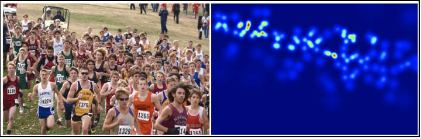

# Crowd-Counting

Imagine a scenario where you are given a picture of a crowd and are asked to
estimate the number of people present in the image. A crowd counting model comes
in handy in such a scenario. In order to train a model that predicts the number of people in an image, we will have
to load the images first. The images should constitute the location of the center of the
heads of all the people present in the image.

 

### Model Training:

  <a href="https://github.com/Ttaha09/Crowd-Counting/blob/main/Model/crowd_counting.ipynb" rel="nofollow noreferrer">
    Model Training
 

### Connect with me:

  <a href="https://www.linkedin.com/in/taha-tamir-351272145/" rel="nofollow noreferrer">
     LinkedIn
  </a> &nbsp;
 
